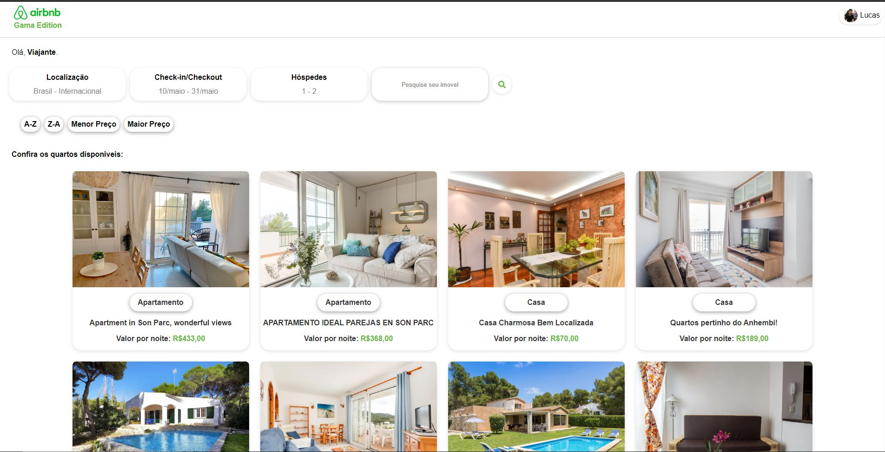
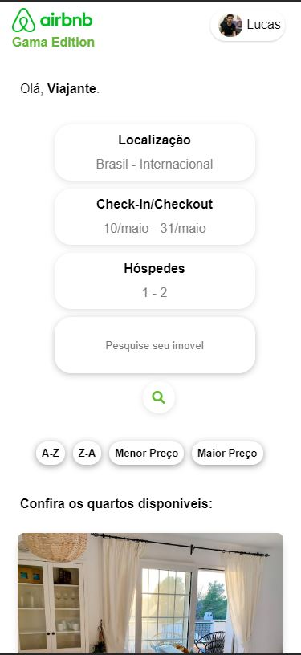

<h4 align="center">
  🚀 Desafio Gama
</h4>

## :rocket: Descrição

Hellooo!

Chegou a hora de mais uma atividade prática - UHUUUL

O seu desafio é criar uma página similar a do Airbnb através do consumo da API de quartos, usando Javascript Vanilla e Flexbox para organizá-los em cards na tela

 

<h2> Funcionalidades adicionadas </h2>
 

<ul>
    <li> Busca por nome </li>
    <li> Ordenação por ordem alfabética e valor </li>
</ul>
 
<h1> Desktop </h1>

  

<h1> Mobile </h1>

  

